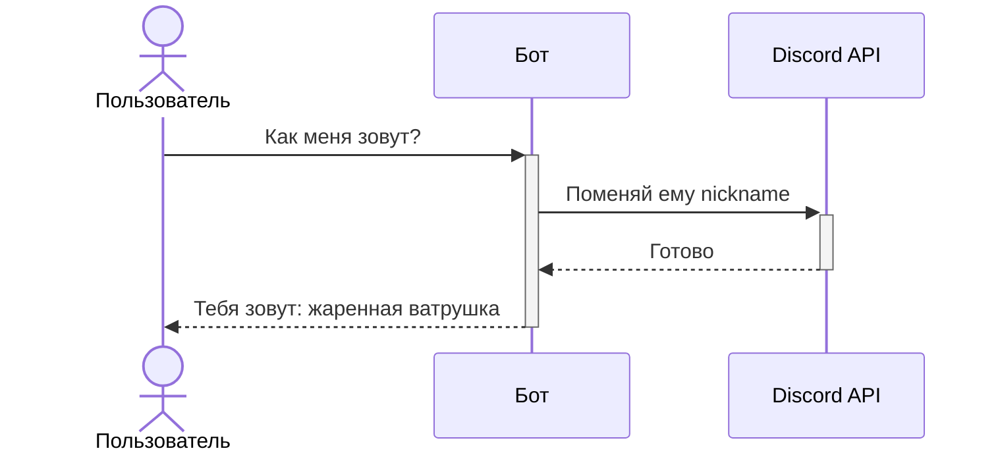
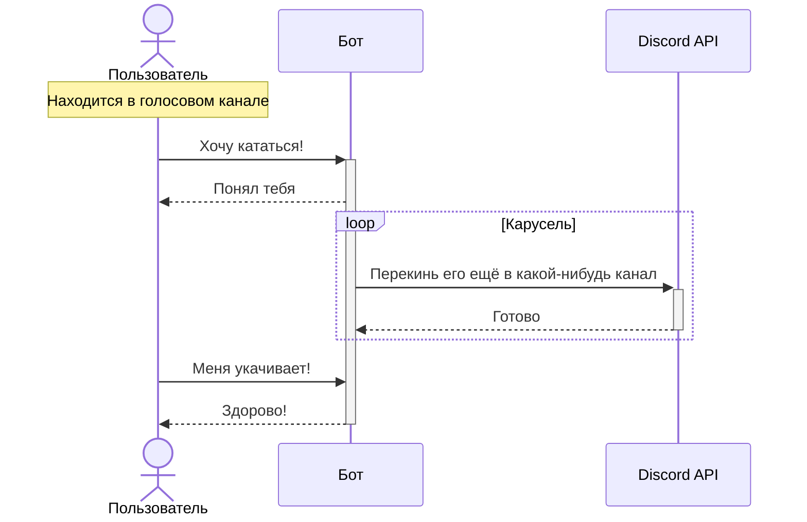

# Команды

## Как меня зовут

## Скажи что-нибудь

## Карусель

Пользователя, находящегося в голосовом канале, перекидывает по всем доступным для него каналам в случаном порядке. Прекращается либо по таймеру (возможный аргумент команды), либо по вводу команды-отмены.

## Розыгрыш

Наугад (либо с помощью аргумента команды указывается конкретный пользователь) выбирается голосовой канал, куда подключается бот и начинает проигрывать "АТВИНТА (Extreme Bass Boost)" (или нечто подобное). Аудио дорожки могут выбираться наугад из банка. Длительность дорожки не должна быть слишком большой - в противном случае будет уже не смешно.

## Брак

Система брака. В качестве аргумента команды указывается партнёр (либо оба партнёра). Далее каждый из кандидатов должен выразить своё согласие (нажатием на кнопку, вводом ключевой фразы...). Бот хранит список пар.
