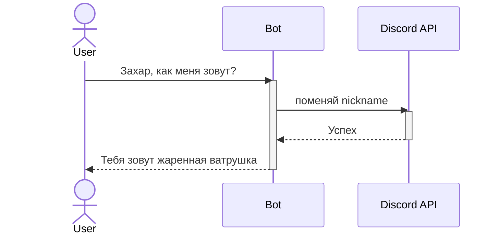
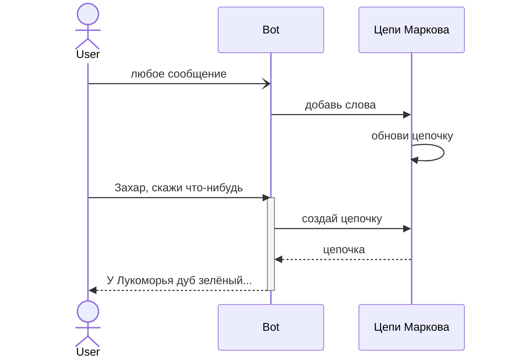

# Команды

## Как меня зовут

```mermaid
sequenceDiagram
    actor User
    participant Bot
    participant Discord as Discord API

    User->>Bot: Захар, как меня зовут?
    activate Bot
    Bot->>Discord: поменяй nickname
    activate Discord
    Discord-->>Bot: Успех
    deactivate Discord
    Bot-->>User: Тебя зовут жаренная ватрушка
    deactivate Bot
```

## Скажи что-нибудь

```mermaid
sequenceDiagram
    actor User
    participant Bot
    participant Chains as Цепи Маркова

    User-)Bot: любое сообщение
    Bot->>Chains: добавь слова
    Chains->>Chains: обнови цепочку

    User->>Bot: Захар, скажи что-нибудь
    activate Bot
    Bot->>Chains: создай цепочку
    Chains-->>Bot: цепочка
    Bot-->>User: У Лукоморья дуб зелёный...
    deactivate Bot
```
