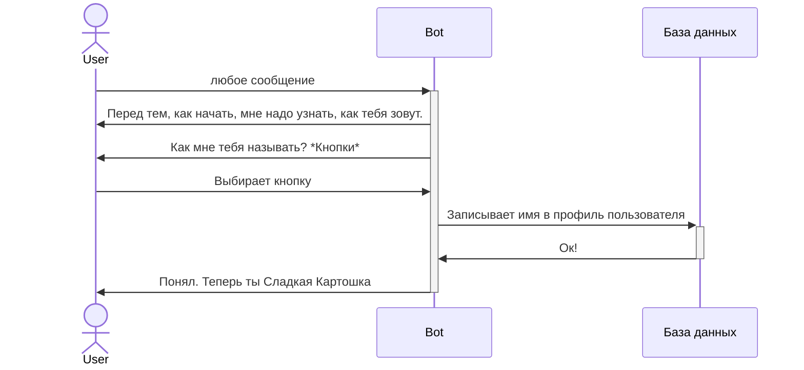

# Интерактивы

Интерактивы триггерятся на определённые условия команды

## Знакомство

Как называть человека во время диалогов.
Так же переименовывает его в это имя.

При знакомстве предоставляет список готовых имён.
Структура у имён такая:
безобидное прилагательное *(прим. фиолетовый)*;
безобидное существительное *(прим. крокодил)*.

Пользователь выбирает имя,
бот сохраняет его у себя в базу и привязывает к пользователю.
После этого переименовывает и обращается с пользователем по "имени".

